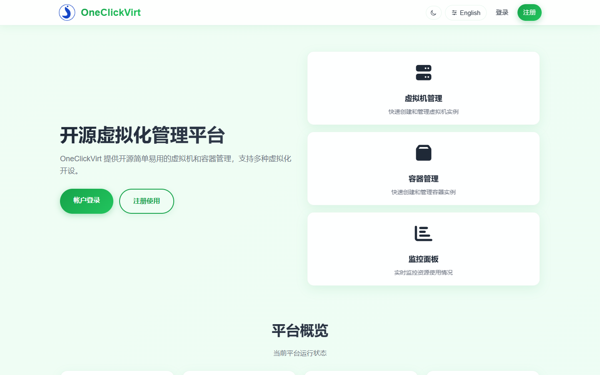
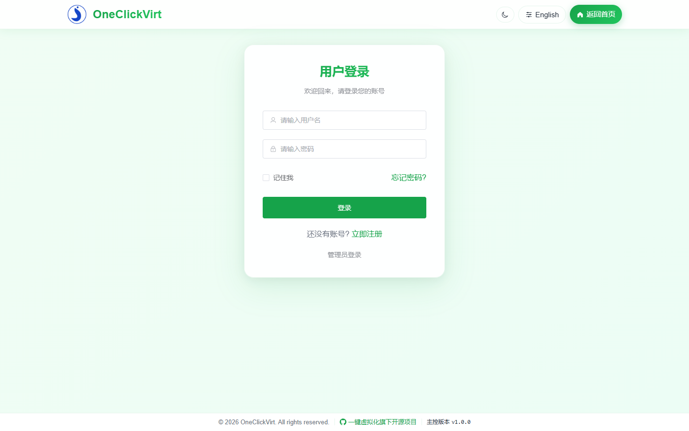
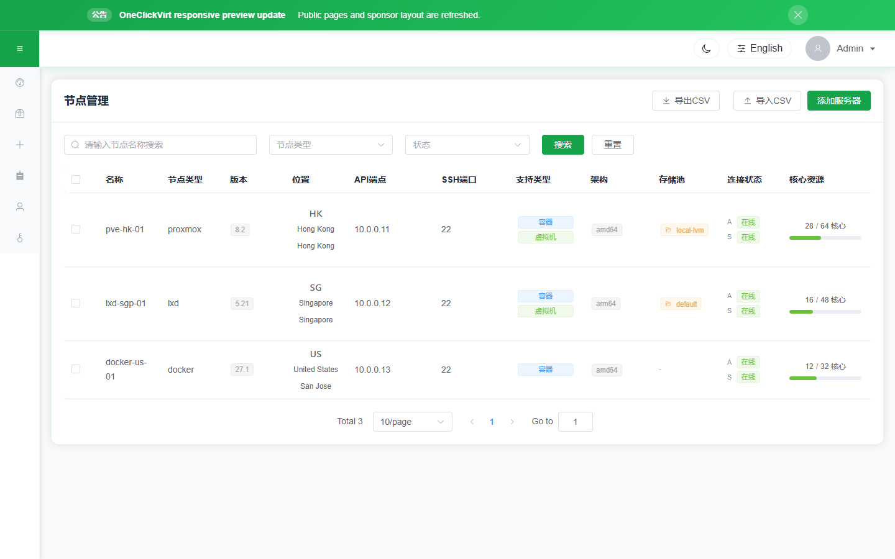
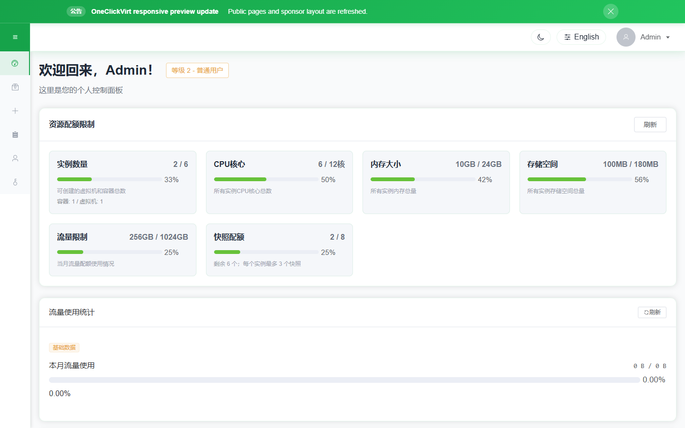
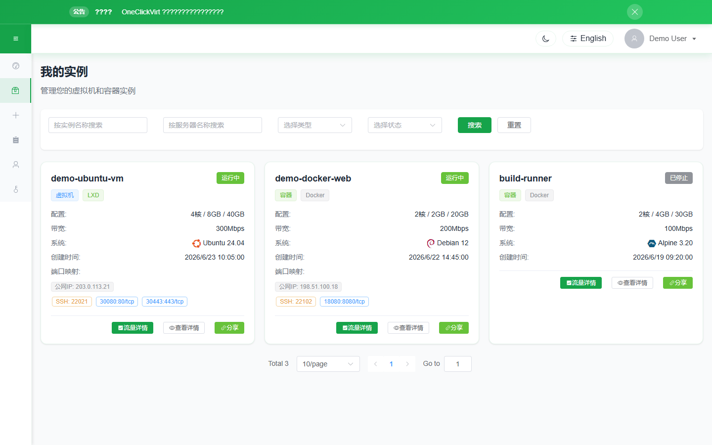

# OneClickVirt 虚拟化管理平台

[](https://github.com/oneclickvirt/oneclickvirt/actions/workflows/build.yml) 

[](https://github.com/oneclickvirt/oneclickvirt/actions/workflows/build_docker.yml)

[](https://github.com/oneclickvirt/oneclickvirt/actions/workflows/integration-tests.yml)

[](https://app.fossa.com/projects/git%2Bgithub.com%2Foneclickvirt%2Foneclickvirt?ref=badge_shield&issueType=license) [](https://app.fossa.com/projects/git%2Bgithub.com%2Foneclickvirt%2Foneclickvirt?ref=badge_shield&issueType=security)

一个可扩展的通用虚拟化管理平台，支持 LXD、Incus、Docker、Podman、Containerd、Proxmox VE、QEMU/KVM 和 KubeVirt。

## **语言**

[English Docs](README.md) | [中文文档](README_ZH.md)

## 详细说明

[www.spiritlhl.net](https://www.spiritlhl.net/guide/oneclickvirt/oneclickvirt_precheck.html)

## 集成测试报告

自动化集成测试报告地址: [oneclickvirt.github.io/oneclickvirt](https://oneclickvirt.github.io/oneclickvirt/)

报告支持中英双语显示、亮色/暗色主题切换、Git ref/SHA/run 元数据和失败用例服务端日志展开，覆盖 200+ API 接口的功能测试、权限测试、边界测试和安全测试。详见 [`action_tests/`](action_tests/) 目录。

## 支持的虚拟化平台

| 类型标识 | 平台 | 实例类型 | 仓库地址 |
|---------|------|---------|---------|
| `lxd` | LXD | container, vm | [oneclickvirt/lxd](https://github.com/oneclickvirt/lxd) |
| `incus` | Incus | container, vm | [oneclickvirt/incus](https://github.com/oneclickvirt/incus) |
| `docker` | Docker | container | [oneclickvirt/docker](https://github.com/oneclickvirt/docker) |
| `podman` | Podman | container | [oneclickvirt/podman](https://github.com/oneclickvirt/podman) |
| `containerd` | Containerd (nerdctl) | container | [oneclickvirt/containerd](https://github.com/oneclickvirt/containerd) |
| `proxmox` | Proxmox VE | container, vm | [oneclickvirt/pve](https://github.com/oneclickvirt/pve) |
| `qemu` | QEMU | vm | [oneclickvirt/qemu](https://github.com/oneclickvirt/qemu) |
| `kubevirt` | KubeVirt | vm | [oneclickvirt/kubevirt](https://github.com/oneclickvirt/kubevirt) |

## 快速部署

尽量不要自行编译，推荐使用二进制文件分离部署或直接docker拉取镜像部署

### 方式一：使用预构建镜像

使用已构建好的多架构镜像，会自动根据当前系统架构下载对应版本。

**镜像标签说明：**

| 镜像标签 | 说明 | 适用场景 |
|---------|------|---------|
| `spiritlhl/oneclickvirt:latest` | 一体化版本（内置数据库）最新版 | 快速部署 |
| `spiritlhl/oneclickvirt:20260624` | 一体化版本特定日期版本 | 需要固定版本 |
| `spiritlhl/oneclickvirt:no-db` | 独立数据库版本最新版 | 不内置数据库 |
| `spiritlhl/oneclickvirt:no-db-20260624` | 独立数据库版本特定日期 | 不内置数据库 |

所有镜像均支持 `linux/amd64` 和 `linux/arm64` 架构。

<details>
<summary>展开查看一体化版本（内置数据库）</summary>

**基础使用（不配置域名）：**

```bash
docker run -d \
  --name oneclickvirt \
  -p 80:80 \
  -v oneclickvirt-data:/var/lib/mysql \
  -v oneclickvirt-storage:/app/storage \
  --restart unless-stopped \
  spiritlhl/oneclickvirt:latest
```

**配置域名访问：**

如果你需要配置域名，需要设置 `FRONTEND_URL` 环境变量：

```bash
docker run -d \
  --name oneclickvirt \
  -p 80:80 \
  -e FRONTEND_URL="https://your-domain.com" \
  -v oneclickvirt-data:/var/lib/mysql \
  -v oneclickvirt-storage:/app/storage \
  --restart unless-stopped \
  spiritlhl/oneclickvirt:latest
```

或者使用 GitHub Container Registry：

```bash
docker run -d \
  --name oneclickvirt \
  -p 80:80 \
  -e FRONTEND_URL="https://your-domain.com" \
  -v oneclickvirt-data:/var/lib/mysql \
  -v oneclickvirt-storage:/app/storage \
  --restart unless-stopped \
  ghcr.io/oneclickvirt/oneclickvirt:latest
```

</details>

<details>
<summary>展开查看独立数据库版本</summary>

使用外部数据库，镜像更小，启动更快：

```bash
docker run -d \
  --name oneclickvirt \
  -p 80:80 \
  -e FRONTEND_URL="https://your-domain.com" \
  -e DB_HOST="your-mysql-host" \
  -e DB_PORT="3306" \
  -e DB_NAME="oneclickvirt" \
  -e DB_USER="root" \
  -e DB_PASSWORD="your-password" \
  -v oneclickvirt-storage:/app/storage \
  --restart unless-stopped \
  spiritlhl/oneclickvirt:no-db
```

**环境变量说明：**
- `FRONTEND_URL`: 前端访问地址（必填，支持 http/https）
- `DB_HOST`: 数据库主机地址
- `DB_PORT`: 数据库端口（默认 3306）
- `DB_NAME`: 数据库名称
- `DB_USER`: 数据库用户名
- `DB_PASSWORD`: 数据库密码

</details>

> **说明**：`FRONTEND_URL` 用于配置前端访问地址，影响 CORS、OAuth2 回调等功能。系统会自动检测 HTTP/HTTPS 协议并调整相应配置，协议头可以是http或https。

### 方式二：使用 Docker Compose

<details>
<summary>展开查看 Docker Compose 部署</summary>

使用 Docker Compose 可以一键部署完整的开发环境，采用**分容器部署**架构，包括独立的前端容器、后端容器和数据库容器：

```bash
git clone https://github.com/oneclickvirt/oneclickvirt.git
cd oneclickvirt
cat > .env << 'EOF'
MYSQL_ROOT_PASSWORD=change-this-root-password
MYSQL_PASSWORD=change-this-app-password
EOF
docker-compose up -d --build || docker compose up -d --build
```

**默认配置说明：**

- 前端服务：`http://localhost:8888`
- 后端 API：通过前端代理访问
- MariaDB 数据库：端口 3306，数据库名 `oneclickvirt`
- 数据库凭据：来自 `.env` 的 `MYSQL_ROOT_PASSWORD` 和 `MYSQL_PASSWORD`
- 数据持久化：
  - 数据库数据：Docker volume `mysql_data`
  - 应用存储：`./data/app/`

**初始化配置：**

首次访问时会进入初始化界面，数据库配置请填写：
- 数据库地址：`mysql`（容器名称，不是 127.0.0.1）
- 数据库端口：`3306`
- 数据库名称：`oneclickvirt`
- 数据库用户：`oneclickvirt`
- 数据库密码：使用 `.env` 中的 `MYSQL_PASSWORD`

**自定义端口（可选）：**

如果需要修改前端访问端口，编辑 `docker-compose.yaml` 文件中的 ports 配置：

```yaml
services:
  web:
    ports:
      - "你的端口:80"  # 例如 "80:80" 或 "8080:80"
```

**停止服务：**

```bash
docker-compose down
```

**查看日志：**

```bash
docker-compose logs -f
```

**清理数据：**

```bash
docker-compose down
rm -rf ./data
```

</details>

### 方式三：裸机全依赖安装

<details>
<summary>展开查看全量安装脚本</summary>

`scripts/install_full.sh` 会在一个流程中安装数据库、反向代理、TLS 配置、前端、后端和系统服务，支持 MySQL 兼容本地数据库（MySQL 或 MariaDB）以及 Caddy/Nginx/OpenResty。

安装器会自动识别常见 Linux 与类 Unix 目标，包括 Debian/Ubuntu、RHEL/CentOS/Rocky/Alma/Fedora/Amazon Linux、openSUSE/SLES、Arch/Manjaro、Alpine 和 BSD 包管理器；同时识别 systemd、OpenRC、rc.d/service 和无 init 环境。在原生 MySQL 包不可用或不稳定的发行版上，安装器会自动回退到 MariaDB 作为 MySQL 兼容后端；如需禁用该行为可使用 `--no-db-fallback`。BSD 安装需要存在对应 OS/架构的 release 二进制，否则请使用 Docker/Linux 或从源码构建服务端。

域名输入会自动识别协议前缀：输入 `https://panel.example.com` 自动启用 TLS，输入 `http://panel.example.com` 自动关闭 TLS，无前缀则交互询问。

```bash
curl -fsSL https://raw.githubusercontent.com/oneclickvirt/oneclickvirt/main/scripts/install_full.sh -o install_full.sh
bash install_full.sh
```

非交互部署示例：

```bash
# HTTPS 自动启用 TLS
bash install_full.sh \
  --non-interactive \
  --domain https://panel.example.com \
  --email admin@example.com \
  --db-type mariadb \
  --proxy caddy

# HTTP 纯端口模式，不启用 TLS
bash install_full.sh \
  --non-interactive \
  --domain http://192.168.1.100 \
  --proxy caddy
```

常用自动化参数：

```bash
bash install_full.sh --version v1.2.3 --db-wait-timeout 300
bash install_full.sh --db-type mysql --no-db-fallback
```

安装脚本默认要求至少 20 GB 可用磁盘和 4 GB 内存。生成的数据库密码会在安装摘要中输出，请在关闭终端前保存。

</details>

### 方式四：自己编译打包

<details>
<summary>展开查看编译步骤</summary>

如果需要修改源码或自定义构建：

**一体化版本（内置数据库）：**

```bash
git clone https://github.com/oneclickvirt/oneclickvirt.git
cd oneclickvirt
docker build -t oneclickvirt .
docker run -d \
  --name oneclickvirt \
  -p 80:80 \
  -v oneclickvirt-data:/var/lib/mysql \
  -v oneclickvirt-storage:/app/storage \
  --restart unless-stopped \
  oneclickvirt
```

Docker 构建会自动内嵌 `scripts/install_agent.sh`。如果你还希望控制端镜像直接提供本地 Agent 发布包，而不是在下载时 302 跳转到 GitHub Releases，请在执行 `docker build` 前把下面这些文件放到 `server/assets/agent/`：

```text
install_agent.sh
oneclickvirt-agent-linux-amd64.tar.gz
oneclickvirt-agent-linux-arm64.tar.gz
```

**独立数据库版本：**

```bash
git clone https://github.com/oneclickvirt/oneclickvirt.git
cd oneclickvirt
docker build -f Dockerfile.no-db -t oneclickvirt:no-db .
docker run -d \
  --name oneclickvirt \
  -p 80:80 \
  -e FRONTEND_URL="https://your-domain.com" \
  -e DB_HOST="your-mysql-host" \
  -e DB_PORT="3306" \
  -e DB_NAME="oneclickvirt" \
  -e DB_USER="root" \
  -e DB_PASSWORD="your-password" \
  -v oneclickvirt-storage:/app/storage \
  --restart unless-stopped \
  oneclickvirt:no-db
```

直接执行 Go 源码编译时也是同样逻辑：`server/assets/agent/` 里的本地 Agent 资源是可选的，缺失时会回退到官方 GitHub 安装脚本和 Release 包，不会因此导致控制端构建失败。

</details>

### 方式五：手动开发部署

<details>
<summary>展开查看开发部署步骤</summary>

#### 环境要求

* Go 1.25.0
* Node.js 22+
* MySQL 5.7+
* npm 或 yarn

#### 环境部署

1. 构建前端
```bash
cd web
npm i
npm run serve
```

2. 构建后端
```bash
cd server
go mod tidy
go run main.go
```

3. 开发模式下不需要反代后端，vite已自带后端代理请求。

5. 在mysql中创建一个空的数据库```oneclickvirt```，记录对应的账户和密码。

6. 访问前端地址，自动跳转到初始化界面，填写数据库信息和相关信息，点击初始化。

7. 完成初始化后会自动跳转到首页，可以开始开发测试了。

#### 本地开发

* 前端：[http://localhost:8080](http://localhost:8080)
* 后端 API：[http://localhost:8888](http://localhost:8888)
* API 文档：[http://localhost:8888/swagger/index.html](http://localhost:8888/swagger/index.html)

</details>

## 初始账户

首次初始化时会根据初始化表单创建管理员账户。快捷填充会每次生成随机强密码，请在提交表单前保存生成的密码。

## 配置文件

主要配置文件位于 `server/config.yaml`

## 致谢

感谢以下平台提供的测试：

<a href="https://community.ibm.com/zsystems/form/l1cc-oss-vm-request/">
  
</a>

<a href="https://console.zmto.com/?affid=1524">
  
</a>

<a href="https://fossvps.org/">
  
</a>

<a href="https://linux.do/">
  
</a>

<a href="https://dartnode.com?aff=bonus">
  
</a>

<a href="https://www.jtti.cc/zh/activity/special-offer.html?z=oneclickvirt">
  
</a>

## LICENSE

[](https://app.fossa.com/projects/git%2Bgithub.com%2Foneclickvirt%2Foneclickvirt?ref=badge_large&issueType=license)

## 演示截图








